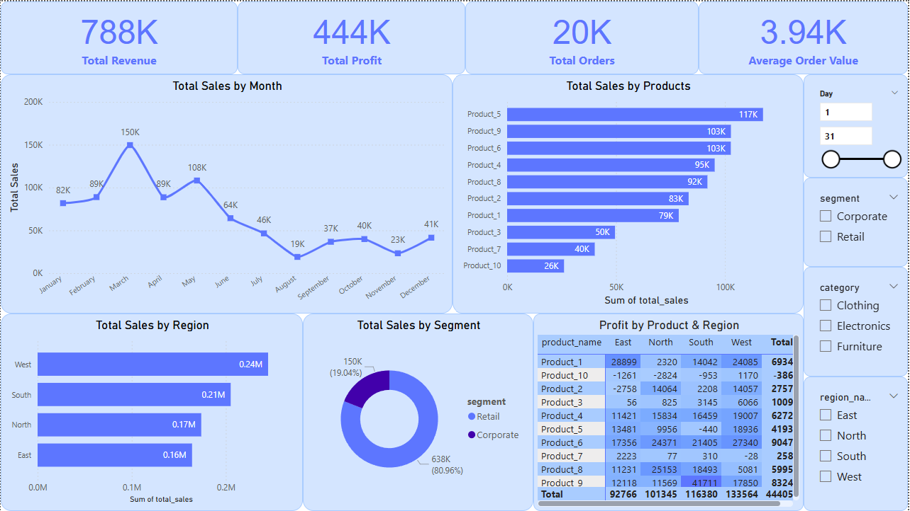

# Sales-Performance-Dashboard

#  Sales Performance Dashboard (Power BI + SQL)

A data analytics project using SQL for data modeling and Power BI for data visualization. The dashboard provides insights into sales, profits, and customer behavior across regions and segments.

---

##  Project Overview

This dashboard was built to analyze:

-  Total Revenue and Profit
-  Sales by Product, Region, and Customer Segment
-  Monthly Sales Trends
-  Top Performing Products
-  Interactive Filtering by Region, Category, and Segment

---

##  Tools Used

- **MySQL** – Data cleaning, transformation, and view creation
- **Power BI** – Data visualization
- **DAX** – For calculated measures

---

##  Files Included

| File | Description |
|------|-------------|
| `cleaned_sales.sql` | Final, cleaned dataset used in Power BI |
| `Sales_Performance_Dashboard.pbix` | Power BI dashboard file |
| `Screenshots/` | Preview images of the dashboard |
| `README.md` | Project documentation |

---

##  Dashboard Preview

---

##  Key Insights

-  **West region** contributed the highest total sales among all regions.
-  **Product_5** and **Product_9** were the top revenue-generating products.
-  The **Retail segment** was more profitable than the Corporate segment.
-  **Sales peaked in March**, suggesting seasonal demand or promotional success.
-  The **Clothing category** had the highest overall profit margins.
-  Retail customers placed higher-value orders on average than corporate.

---

##  How to Use

1. Clone/download the repo
2. Open the `.pbix` file in Power BI Desktop
3. Interact with filters and visuals

---

##  Contact

Created by **Ashish Kumar Gaur**  
[[LinkedIn Profile](https://www.linkedin.com/in/ashish-gaur-36b8a78a/)] | [ashishg235@gmail.com]
